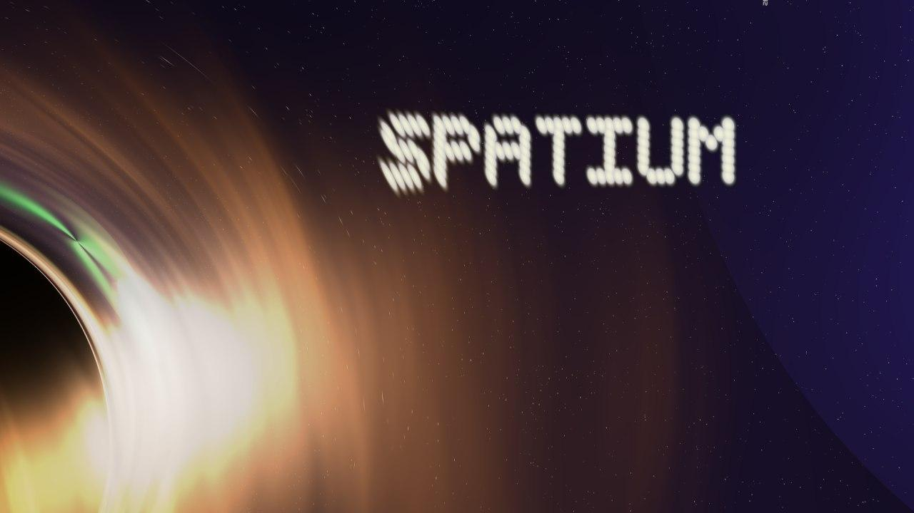

<p align="center"></p>

# Spatium

**Any mathematical space, one library.**

Geometry libraries hardcode their space: CGAL's kernels, Eigen's linear algebra, GLM's vectors all assume flat Euclidean R^N wired into every type. Need geodesics on a sphere, distances in hyperbolic space, mesh operations on some other manifold? That's a different, specialized library each time — or a parallel hand-written stack duplicating the one you already have.

Spatium doesn't hardcode a space. It has a concept hierarchy — Set → TopologicalSpace → MetricSpace → NormedSpace → InnerProductSpace → Manifold → RiemannianManifold → Surface — and any type satisfying a concept's requirements gets the whole library for free:

```cpp
struct FlatTorus { /* distance(), exp_map(), log_map(), project()... */ };
static_assert(spatium::RiemannianManifold<FlatTorus>);
// Mesh<FlatTorus>, subdivision, geodesics, morphisms — all work automatically.
```

C++23, in large part header-only — three deliberate exceptions exist where real complexity made that the wrong tradeoff, not an oversight: the Vulkan viewer needs genuine C linkage, the periodic-table data backs a single compiled translation unit, and the `physics/mechanics` research track plus optional CUDA/ipc-toolkit integrations sit outside the header-only spine on purpose. See [Architecture](docs/architecture.md#header-only-spine-and-three-principled-exceptions) for the honest breakdown, not a marketing gloss.

## Gallery

<p align="center">
  <a href="gallery/blackhole_gr.mp4"></a>
  <br><sub>Kerr black hole, full 4-coordinate geodesic integration, GPU-rendered (CUDA) at 1920x1080 — click for video</sub>
</p>

## Features

- **Space hierarchy as concepts** — Set, TopologicalSpace, MetricSpace, NormedSpace, InnerProductSpace, Manifold, RiemannianManifold, Surface
- **Concrete spaces** — Euclidean\<N\>, Sphere\<N\>, Hyperbolic\<N\>, ParametricSurface, ImplicitSurface
- **Geometric primitives & operations** — Line/Ray/Segment/Hyperplane/Triangle/Polygon/Circle/Disk/Box/Simplex; intersection (Moller-Trumbore, slab method, analytical ray-quadric), distance, boolean ops, clipping
- **Mesh & geodesics** — Mesh\<Surface\>, subdivision with surface projection, LOD chains, geodesic distance (Dijkstra + heat method), geodesic Voronoi, discrete exterior calculus
- **Morphisms** — typed maps between spaces with pipe composition: `point | scale | shift | project`
- **Arbitrary precision** — Boost.Multiprecision (Real50, Real100, any digit count), same generic algorithms
- **Physics & relativity research track** — geometric-mechanics integrators (symplectic, Lie-group, variational), metric-agnostic geodesic integration (Schwarzschild/Kerr), and RSC — a trained dispatcher that picks which method/precision to use per problem, not hand-tuned; see [Roadmap](docs/ROADMAP.md)
- **N-dimensional, zero-cost** — templated on dimension and scalar type, concepts checked at compile time, no virtual dispatch

## Quick Start

```cpp
#include <spatium/spatium.hpp>
#include <print>

using namespace spatium;
using namespace spatium::geometry;

int main() {
    // Geometry — clean factory syntax
    auto t = tri(Vec3{0, 0, 0}, Vec3{1, 0, 0}, Vec3{0, 1, 0});
    std::println("area = {:.4f}, normal = {}", t.area(), t.normal());

    // Intersection via pipe
    auto r = *ray(Vec3{0.25, 0.25, 5}, Vec3{0, 0, -1});
    if (auto hit = r | t)
        std::println("hit at {}", *hit);

    // Morphism pipeline
    auto scale = morph<E3, E3>([](const Vec3& p) { return p * 2.0; });
    auto proj  = morph<E3, E2>([](const Vec3& p) -> Vec2 { return {p[0], p[1]}; });
    auto result = pt<E3>(Vec3{1, 2, 3}) | scale | proj;
    std::println("{}", result);  // P(2, 4)

    // Sphere geodesics
    S2 sphere;
    auto north = pt<S2>(Vec3{0, 0, 1});
    auto east  = pt<S2>(Vec3{1, 0, 0});
    auto tangent = north.log(east, sphere);
    auto midpoint = north.exp(tangent, 0.5, sphere);
    std::println("geodesic midpoint: {}", midpoint);

    // Mesh subdivision
    auto mesh = mesh::icosahedron(sphere);
    auto refined = mesh::subdivide(mesh, sphere, 3);
    std::println("{}", refined);  // Mesh{V=642 F=1280 E≈1920}
}
```

## Build

Requires C++23 (GCC 15+ or Clang 19+), CMake 3.28+, Catch2 v3 for tests.

```bash
# With Nix (recommended)
nix develop
cmake --preset default
cmake --build --preset default
ctest --preset default

# Without Nix
cmake -B build -G Ninja -DCMAKE_BUILD_TYPE=Debug
ninja -C build
```

`CMakePresets.json` has presets beyond `default` for common configurations — `release` (Eigen, for RSC training-heavy work), `modules` (the C++23 modules build path), `noeigen`, `vulkan-dev`, `cuda`, and two benchmark-harness presets. `cmake --list-presets` shows all of them.

### CMake options

| Option                       | Default | Notes |
|------------------------------|:-------:|-------|
| `SPATIUM_BUILD_TESTS`        | `ON`    | Catch2 v3 unit tests (`ctest --preset default`) |
| `SPATIUM_BUILD_EXAMPLES`     | `ON`    | All `examples/*` binaries |
| `SPATIUM_BUILD_BENCHMARKS`   | `OFF`   | Google Benchmark suite (`benchmarks/`) |
| `SPATIUM_BUILD_VIEWER`       | `ON`    | Vulkan + GLFW + shaderc viewer. Emits a `WARNING` and skips the target if any of those packages are missing. |
| `SPATIUM_EIGEN`              | `OFF`   | Required by the heat-method geodesic solver and the cotangent-Laplacian DEC operators. |
| `SPATIUM_NATIVE_ARCH`        | `OFF`   | Adds `-march=native`. Resulting binaries are not portable across CPUs — use only for local performance work. |
| `SPATIUM_USE_MODULES`        | `OFF`   | C++23 named-modules build. Currently behind the header tree (see the option's own comment in `CMakeLists.txt`) — not a compiler-bug wait, real catch-up work. |
| `SPATIUM_IPC_TOOLKIT`        | `OFF`   | Implicit contact physics via [ipc-toolkit](https://github.com/ipc-sim/ipc-toolkit) (Newton + log-barrier + CCD). `FetchContent`-based, pulls its own dependency tree. |
| `SPATIUM_CUDA`                | `OFF`   | CUDA GPU kernels (`gpu/`) for GR ray tracing. Requires nvcc; not part of a default build. |
| `SPATIUM_BUILD_RSC_TOOLS`     | `ON`    | RSC training tools (`rsc/tools/train_base`, ...). |
| `IMGUI_DIR` (env or `-D`)    | unset   | Source path of Dear ImGui; enables the in-viewer panel when set. |

## Using in Your Project

### CMake FetchContent

```cmake
include(FetchContent)
FetchContent_Declare(spatium
    GIT_REPOSITORY https://github.com/Vaniell0/spatium.git
    GIT_TAG main
)
FetchContent_MakeAvailable(spatium)

target_link_libraries(your_target PRIVATE Spatium::sdk)
```

### After Install

```cmake
find_package(Spatium REQUIRED)
target_link_libraries(your_target PRIVATE Spatium::sdk)
```

## Defining Your Own Space

Any struct with the right methods satisfies the concepts automatically:

```cpp
struct FlatTorus {
    using ScalarType = double;
    using PointType = Vec<double, 2>;
    using TangentVector = Vec<double, 2>;
    static constexpr std::size_t dimension = 2;
    static constexpr bool is_complete = true;

    bool contains(const PointType& p) const { /* ... */ }
    ScalarType distance(const PointType& a, const PointType& b) const { /* ... */ }
    PointType exp_map(const PointType& p, const TangentVector& v, ScalarType t) const { /* ... */ }
    TangentVector log_map(const PointType& p, const PointType& q) const { /* ... */ }
    ScalarType metric_at(const PointType& p, const TangentVector& u, const TangentVector& v) const { /* ... */ }
    PointType project(const PointType& p) const { /* ... */ }
    TangentVector normal(const PointType& p) const { /* ... */ }
};

static_assert(spatium::RiemannianManifold<FlatTorus>);
static_assert(spatium::Surface<FlatTorus>);
// Mesh<FlatTorus>, subdivision, morphisms — all work automatically.
```

## Arbitrary Precision

```cpp
#include <spatium/core/precision.hpp>

using namespace spatium;

// 50-digit precision
Euclidean<3, Real50> space;
Vec<Real50, 3> a{Real50{0}, Real50{0}, Real50{0}};
Vec<Real50, 3> b{Real50{3}, Real50{4}, Real50{0}};
auto d = space.distance(a, b);  // 5.000...000 (50 digits)
```

## Documentation

- [Architecture](docs/architecture.md) — concept hierarchy, design decisions, the real dependency graph
- [Conventions](docs/conventions.md) — namespace/subdivision/error-handling rules, and the known violations being fixed
- [API Reference](docs/api-reference.md) — all types, methods, concepts
- [Quick Start Guide](docs/quickstart.md) — getting started
- [Extending Spatium](docs/extending.md) — defining custom spaces and primitives
- [Roadmap](docs/ROADMAP.md) — what's done, what's planned, project history
- [Concept-Driven Physics](docs/concept-driven-physics.md) — how `physics/mechanics/` fits the concept hierarchy

## Project Structure

```
include/spatium/
    core/                concepts, error, verify, precision
    algebra/             Vec, Matrix, Quaternion, Complex, Dual (autodiff), calculus,
                         ODE solvers, linear solve, polynomial solvers, Eigen interop
    algebra/groups/      SO3, SE3
    spaces/              Euclidean, Sphere, Hyperbolic, ParametricSurface, ImplicitSurface
    geometry/            primitives, intersection, distance, boolean ops, ray_surface (Quadric)
    mesh/                Mesh, subdivision, LOD, topology, geodesic, voronoi, DEC
    spatial/             BVH (SAH build, ray_cast, nearest, query_box)
    discrete/            FiniteSet, GeometricSet
    render/              supersample_pixel(), camera, write_image, parallel_for_rows
    io/                  Table, SVG, OBJ, STL
    physics/             periodic-table element data (the one compiled TU)
    physics/atomic/      atom/orbital models, Bohr model, SVG rendering
    physics/mechanics/   integrators, symplectic/Lie-group/variational structure, contact
    physics/relativity/  Schwarzschild/Kerr geodesic integration, accretion disks
    viewer/              Vulkan app (multi-mesh, point clouds, ImGui)
    point.hpp, morphism.hpp, spatium.hpp
rsc/                     RSC — trained dispatcher on top of Spatium (7 domains, see docs/ROADMAP.md)
tests/, examples/, benchmarks/
```

### Demos

```bash
nix run .#primitives                    # unified primitives + BVH raycast, interactive Vulkan
nix run .#tumbling                      # Dzhanibekov-effect rigid-body tumble (LGVI), frame sequence
```

More demos exist in `examples/` — analytical ray tracing, a Schwarzschild/Kerr GR raytracer, an Ellis wormhole flythrough, and others; `cmake --list-presets` and `nix flake show` list every buildable target.

## License

Apache License 2.0 — see [`LICENSE`](LICENSE). Contributing guide: [`CONTRIBUTING.md`](CONTRIBUTING.md).
Project history: [`docs/ROADMAP.md`](docs/ROADMAP.md).
